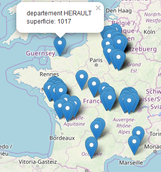

```{r setup, include=FALSE}
knitr::opts_chunk$set(echo = FALSE)
source("SpatialStats.R")
source("departement.R")
source("polluant.R")
```

## Entrepot de données au format i2b2

Un entrepôt de données, ou data Warehouse, est une vision centralisée et universelle de toutes les informations de l'entreprise. C'est une structure (comme une base de données) qui a pour but, contrairement aux bases de données, de regrouper les données de l'entreprise pour des fins analytiques et pour aider à la décision stratégique.
Dans le cadre de notre projet nous avons opté pour le format i2b2 qui représente l'entrepôt de données sous la forme d'une étoile. Cela permet de mettre en relation directe les dimensions (axes avec lesquels on veut faire l'analyse) et les faits (ce sur quoi va porter l'analyse) dans un entrepôt de données. Le format i2b2 a pour avantage d'étre adapté à une recherche multi domaines (surtout pour la santé), est simple, on peut l'utiliser à n'importe quelle échelle et il possède une dimension collaborative.
Nous pouvons observer dans la figure ci-dessous la structure de notre entrepôt de données.

```{r Entrepot de données image, echo=FALSE, out.width = '100%'}
print ("Entrepot de données")
knitr::include_graphics("DATA/Entrepot_De_Données.png")
```

Cet entrepôt de données contient 5 tables de dimensions (Polluants, Radioactifs, Départements, Etablissement, Région) et une table de fait centrale (Observation_Exposition).
La dimension "géographique" est représentée dans cet entrepôt de données à travers les tables "Départements", "Région" et "Etablissement". Cependant, nous avons choisi de ne pas insérer de tables concernant les communes et villes car elles étaient absentes du fichier de données de maladie "evenement.csv" et donc nous n'aurions pas pu utiliser ces 2 tables pour notre étude statistique. De plus, la quantité d'informations disponible pour ces 2 entités n'était pas suffisante pour construire une table "communes" et une table "villes".
Nous n'avons pas inséré de table "Maladie" car nous avons jugé que ces données changeait trop souvent et qu'il n'était donc pas nécessaire de la faire dans notre entrpét de données. En effet, lorsque l'on fait une étude statistique pour une maladie X et des polluants/déchets radioactifs, les données concernant les polluants ou les déchets radioactifs ne changent pratiquement pas (update tous les ans) alors que celui concernant la maladie change assez souvent et est spécifique de la maladie étudiée.
Pour pouvoir différencier le type de déchets obtenus à l'aide de la table de fait nous lui avons mit comme attribut "Type_Dechet" qui prend comme valeur "Radioactif" ou "Polluant" et permet donc de spécifier l'origine du déchet.

##  Cartes interactives : Shiny & Leaflet
Shiny est un package R open-source permettant de créer des applications Web trés rapides et puissantes utilisant simplement la syntaxe R. Pour ce qui est de la cartographie interactive,nous avons uniquement utilisé Leaflet (bibliothéque de cartographie interactive trés populaire écrite en JavaScript) car le package R de Leaflet a largement suffi à fournir une solution.
Nous avons struturé notre application dans un seul fichier qui contient tous les composants d'interface et la logique seveur.Une fois l'application de base fonctionnelle,nous avons défini la carte de sorte que la vue initiale soit celle de la France. Pour cela nous avons créé une sortie "ui" àfin de la récupérer comme entrée dans le serveur grace à la fonction renderLeaflet. Dans l'ensemble de données la colonne "COORDONNEE" contient les informations nécessaires(Longitude etr Latitude) pour la cartographie. Cependant, cette colonne est un format de chaîne combinée, nous avons donc commencé par créer deux colonnes (Latitude et Longitude) pour les séparer et  pour cela nous avons utilisé la fonction "separate" du paquet tidyverse / tidyr. Afin de convertir les colonnes Latitude et Longitude en numérique, nous avons employé la fonction "as.numeric()".
Cependant, notre ensemble de données compte plus de 65 000 de lignes, ce qui entraîne une augmentation du temps de lancement de l'application. Pour résoudre ce problème, nous allons effectuer des traitements, puis enregistrer le jeu de données traité en tant que "fichier.rds", qui est une version sérialisée du jeu de données, et le compresser à l'aide de la compression gzip. Tout cela nous a permit de gagner du temps à chaque lancement de notre application. Pour les points de mappage, nous avons pris 100 points que nous avons sauvegardé dans le fichier.rds. Nous avons ainsi obtenu 2 cartes interactives affichées ci-dessous, ces cartes interactives concernent soit les départements français et leur informations (nom et population) soit la quantité de polluants produits par départements.

```{r carte interactive départements image, echo=FALSE, out.width = '100%'}
print ("carte interactive des départements français")

```

```{r carte interactive polluants en fonction des départements image, echo=FALSE, out.width = '100%'}
print ("carte interactive de la quantité de polluants par départements")

```


## Statistiques Spatiales
### Choix et préparation des données

Pour pouvoir faire les statistiques spatiales concernant la maladie X, deux des 4 sources proposées ont été prises : les déchets radioactifs et les polluants. Ces 2 sources nous ont permis d'obtenir 2 fichier csv contenant les données au niveau départemental voir communal. Cependant, le fichier de données de la maladie X ne permettait de travailler que jusqu'au niveau départemental. Nous avons donc fait une analyse au niveau départemental de la relation entre la maladie X et les déchets radioactifs ou les polluants. De plus, il a fallu obtenir la carte des départements franéais pour un affichage sous R et cela nous a contraint à regrouper par départements les données contenues dans les fichiers pour la maladie X, les déchets radioactifs et les polluants tout en reformattant leur nom afin qu'ils correspondent à ceux sur la carte de france récupérées (suppression des accents, nom en majuscule...). Puis nous avons crée deux data frame contenant les données d'intérét pour effectuer les statistiques spatiales : une pour la maladie X plus les déchets radioactifs et une pour la maladie X plus les polluants.


```{r Maladie X et dechets radioactifs ou polluants}
print("Maladie X en fonction des déchets radioactifs")
summary(Data_Maladie_Radioactifs_By_Dep)
print("Maladie X en fonction des polluants")
summary(Data_Maladie_Polluants_By_Dep)
```

### Cartographie de la maladie X en fonction des déchets radioactifs ou des polluants

Suite à cela nous avons commencé par représenté sur la carte le nombre de malade en fonction du nombre de déchets radioactifs (2ème graphe) ou de polluants (1er graphe) avant de faire la méthode de concentration. 

```{r cartographie maladie X ~ déchets radioactifs ou polluants, echo=FALSE}
plot(france_reg.spdf, col = "grey80")
propSymbolsChoroLayer(spdf = france_reg.spdf, spdfid = "NOM_DEPT", df = Data_Maladie_Polluants_By_Dep,                    
                      var = "Malades", var2 = "Quantite",
                      col = colsPolluants, border = "grey50", inches = 0.15,
                      breaks = bksPolluants, legend.var2.values.rnd = 0,
                      legend.var.title.txt = "Nombre\nde personnes atteintes de la maladie X", 
                      legend.var2.title.txt = "Nombre de polluants",
                      legend.var.pos = "bottomleft",
                      add=TRUE)
plot(france_reg.spdf, col = "grey80")
propSymbolsChoroLayer(spdf = france_reg.spdf, spdfid = "NOM_DEPT", df = Data_Maladie_Radioactifs_By_Dep,                    
                      var = "Malades", var2 = "Quantite",
                      col = colsRadioactifs, border = "grey50", inches = 0.15,
                      breaks = bksRadioactifs, legend.var2.values.rnd = 0,
                      legend.var.title.txt = "Nombre\nde personnes atteintes de la maladie X", 
                      legend.var2.title.txt = "Nombre de déchets radioactifs",
                      legend.var.pos = "bottomleft",
                      add=TRUE)
```

Comme nous pouvons le voir sur ces 2 graphiques, il semble qu'il n'y ait pas de relation entre la quantité de polluants ou de déchets radioactifs et de personnes ayant la maladie X.

### Méthode de concentration : Test de Stone

Le test de Stone permet de donner le nombre de zones (ici, de départements) ayant le risque accumulé maximum et donc, dans notre cas, le nombre de départements ayant le plus haut taux de chances d'avoir des malades atteint de X. Pour pouvoir faire ce test statistique il faut d'abord obtenir à partir de nos données, la zone présentant le plus de risque et donc il faut représenter sur la carte les zones en fonction de leur risque d'avoir des personnes atteintes de la maladie X. Nous avons donc effectué une standardisation des données pour chacune des 2 relations testées (Maladie X et déchets radioactifs ET Maladie X et polluants) dont nous pouvons voir un exemple de résultats ci-dessous.

```{r test de Stone Maladie X et polluants}
summary(france_reg_MaladiePolluants.spdf)
```

Puis nous avons obtenus les résultats ci-dessous pour la carte de france (polluants 1er graphe et déchets radioactifs 2ème graphe).

```{r cartographie test de Stone maladie X ~ déchets radioactifs ou polluants, echo=FALSE}
france_reg_MaladiePolluants_spplot
france_reg_MaladieRadioactifs_spplot
```

Il est important de noter que comparer aux résultats pour les déchets radioactifs, sur la carte on a pas ou peu de zones présentant un risque pour la maladie X en fonction des polluants. Ceci est faux et est dé au fait qu'il y a certaines régions possédant d'énorme quantité de polluants comparé aux autres et donc, comme nous avons normalisées les données à représenter, la plupart des valeurs sont proches de 0 car la différence entre ces valeurs et la valeur maximale est trés importante.
A partir des résultats de ces 2 cartographies nous avons identifié comme zone à plus haut risque la Lozére pour les polluants et la Corréze pour les déchets radioactifs et nous avons donc utilisé ces régions pour le test de stone dont les résultats sont visibles ci-dessous.

```{r test de Stone Maladie X et dechets radioactifs ou polluants}
print("Maladie X en fonction des polluants")
stone.stat(france_reg_MaladiePolluants_Stone, region=regionPolluants, lambda=1)
stone.test(Observed~offset(log(Expected)), france_reg_MaladiePolluants_Stone, model="poisson", R=99,
           region=regionPolluants, lambda=1)
print("Maladie X en fonction des déchets radioactifs")
stone.stat(france_reg_MaladieRadioactifs_Stone, region=regionRadioactifs, lambda=1)
stone.test(Observed~offset(log(Expected)), france_reg_MaladieRadioactifs_Stone, model="poisson", R=99,
           region=regionRadioactifs, lambda=1)
```

Comme nous pouvons le voir malgré des p-value faibles, l'hypothése du point source (Lozére ou Corréze) comme responsable de la maladie X est fausse et ce, que ce soit pour les polluants (43 départements) ou pour les déchets radioactifs (10 départements). De plus, il y a trop de départements présentant un risque accumulé maximale pour que cette notion de point source soit vérédique pour la maladie X et les 2 variables étudiées (polluants et déchets radioactifs).

### Méthode de concentration : Test de Moran

Le test de Moran sert à vérifier si il y a une autocorrélation spatiale, l'hypothése nulle étant qu'il n'y a pas d'autocorrélation spatiale. Pour faire ce test sous R il nous faut la matrice des voisins avec leur poids ainsi qu'une matrice au format spécifié par DCluster (Observé, Attendu).
Nous avons donc commencé par récupérer la matrice des voisins avec leur poids à l'aide des fonction poly2nb et nb2listw. La fonction poly2nb permet d'obtenir les voisins et leur poids à partir d'une carte (ou format SpatialPolygonsDataFrame) et la fonction nb2listw permet de transformer le résultat obtenu à l'aide de poly2nb en une liste au format "W" qui est nécessaire pour la fonction de Moran utilisée par le package DCluster. Nous pouvons observer cette liste ci-dessous

```{r création de la liste voisins & poids}
summary(col.W.test)
```

Puis nous avons créer les 2 data frame au format DCluster pour finalement faire le test de Moran sur chacune des 2 matrices. Nous pouvons voir les résultats ci-dessous.

```{r test de Moran Maladie X et dechets radioactifs ou polluants}
print("Maladie X en fonction des polluants")
moranI.stat(data=france_reg_MaladiePolluants_Moran, listw=col.W.test, n=length(france_reg.nb), S0=Szero(col.W.test) )
moranI.stat(data=france_reg_MaladiePolluants_Moran, applyto="residuals", listw=col.W.test, n=length(france_reg.nb),
            S0=Szero(col.W.test) )
moranI.test(Observed~offset(log(Expected)), france_reg_MaladiePolluants_Moran, model="poisson", R=99,
            listw=col.W.test, n=length(france_reg.nb), S0=Szero(col.W.test) )
print("Maladie X en fonction des déchets radioactifs")
moranI.stat(data=france_reg_MaladieRadioactifs_Moran, listw=col.W.test, n=length(france_reg.nb), S0=Szero(col.W.test) )
moranI.stat(data=france_reg_MaladieRadioactifs_Moran, applyto="residuals", listw=col.W.test, n=length(france_reg.nb),
            S0=Szero(col.W.test) )
moranI.test(Observed~offset(log(Expected)), france_reg_MaladieRadioactifs_Moran, model="poisson", R=99,
            listw=col.W.test, n=length(france_reg.nb), S0=Szero(col.W.test) )
```

Que ce soit pour les polluants ou les déchets radioactifs les valeurs étant négatives il n'y a pas d'autocorrélation spatiale.

## Conclusion

Nous avons défini un entrepôt de données au format i2b2 possédant 5 table dimensions (Radioactifs, Polluants, Départements, Régions, Etablissement) et une table de fait centrale (Observation_Exposition). Les tests de statistiques spatiales sur la maladie X en fonction des polluants ou des déchets radioactifs n'a pas mis en évidence une relation et a permit de rejetter l'hypothése du point de source à haut risque (test de Stone) et l'hypothése d'autocorrélation spatiale (test de Moran).
Cependant, nos résultats sont à nuancés car on avait des NA dans nos données ce qui a pu faussés nos résultats parce qu'on a dé enlevé les lignes de données d'intérét qui en possédait et que notre observation à été faite au niveau départemental. Or, ce niveau de granularité pourrait s'avérer insuffisant pour l'étude de la relation entre la maladie X et les polluants ou les déchets radioactifs, il faudrait donc conduire cette analyse au niveau de la commune ou de la ville (nécessité de rajouter du détail dans le fichier maladie X). De plus, notre entrepôt de données ne prend pas en compte la maladie car il a été designé pour la maladie X et donc on a jugé que l'insertion de la maladie au sein de la structure de notre entrepôt de données était inutile (changement trés régulier, méthode et pertinance de la maintenance difficile sans expertise...).
Malgré cela, notre travail est reproductible pour d'autre maladie et variable hors étape de reformatage des données qui peut varier selon les données possédées.
